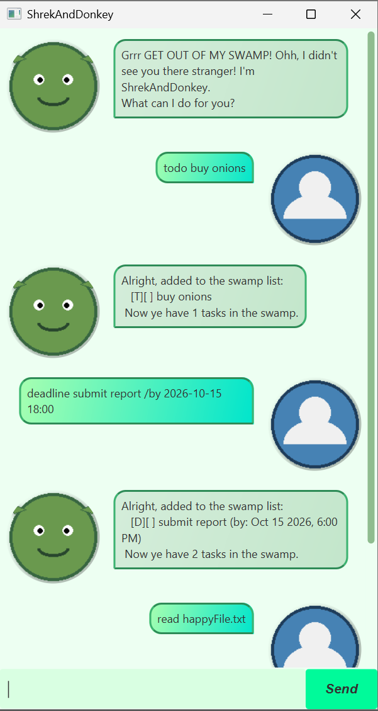

# ShrekAndDonkey User Guide

ShrekAndDonkey is a Shrek-themed task chatbot that helps you keep track of to-dos, deadlines, and events. Type a command in the input box and select **Send** (or press Enter) to manage your swamp list.



## Quick Start

1. Ensure that Java 25 is installed on your computer.
2. Download `shrekanddonkey.jar` and open a terminal in the folder that contains it.
3. Run the application:

    ```text
    java -jar shrekanddonkey.jar
    ```

4. Enter a command in the application input box.

> **Tip:** Commands and command keywords are lowercase. Dates use one of the supported formats shown in [Date Formats](#date-formats).

## Features

### Viewing all tasks: `list`

Displays every task in the current swamp list, numbered from 1.

**Format:** `list`

**Example:**

```text
list
```

### Adding a to-do: `todo`

Adds a task without a date or time.

**Format:** `todo DESCRIPTION`

**Example:**

```text
todo buy onions
```

The task is added to the swamp list as a to-do.

### Adding a deadline: `deadline`

Adds a task with a deadline.

**Format:** `deadline DESCRIPTION /by DATE`

**Example:**

```text
deadline submit report /by 2026-10-15 18:00
```

The task is added with the specified due date and time.

### Adding an event: `event`

Adds a task with a start and end date or time.

**Format:** `event DESCRIPTION /from DATE /to DATE`

**Example:**

```text
event swamp meeting /from 2026-10-20 14:00 /to 2026-10-20 16:00
```

The end date and time must not be earlier than the start date and time.

### Marking a task as done: `mark`

Marks the selected task as completed.

**Format:** `mark N`

`N` is the task number shown by the `list` command.

**Example:**

```text
mark 1
```

### Marking a task as not done: `unmark`

Marks the selected task as incomplete.

**Format:** `unmark N`

`N` is the task number shown by the `list` command.

**Example:**

```text
unmark 1
```

### Deleting a task: `delete`

Removes the selected task from the swamp list.

**Format:** `delete N`

`N` is the task number shown by the `list` command.

**Example:**

```text
delete 2
```

### Finding tasks: `find`

Displays tasks whose descriptions contain the given keyword.

**Format:** `find KEYWORD`

**Example:**

```text
find report
```

### Sorting tasks by date: `sort`

Sorts deadline and event tasks by date. To-dos, which have no date, appear after dated tasks.

**Format:** `sort`

**Example:**

```text
sort
```

### Saving tasks: `write`

Saves the current swamp list to `data/happyFile.txt`. The `data` directory is created automatically when needed.

**Format:** `write`

**Example:**

```text
write
```

### Reading a file: `read`

Displays the contents of a file in the `data` directory. The file name must be supplied without the `data/` prefix.

**Format:** `read FILE_NAME`

**Example:**

```text
read happyFile.txt
```

If the file does not exist, ShrekAndDonkey displays an error message.

### Exiting the application: `bye`

Closes ShrekAndDonkey after displaying a goodbye message.

**Format:** `bye`

**Example:**

```text
bye
```

## Date Formats

Use one of these formats for the `DATE` part of a `deadline` or `event` command:

- `yyyy-MM-dd`, for example `2026-10-15`
- `yyyy-MM-dd HH:mm`, for example `2026-10-15 18:00`
- `yyyy-MM-ddTHH:mm`, for example `2026-10-15T18:00`
- `d/M/yyyy HHmm`, for example `15/10/2026 1800`

## Command Summary

| Command | Purpose |
| --- | --- |
| `list` | Displays all tasks. |
| `todo DESCRIPTION` | Adds a to-do task. |
| `deadline DESCRIPTION /by DATE` | Adds a deadline task. |
| `event DESCRIPTION /from DATE /to DATE` | Adds an event task. |
| `mark N` | Marks task `N` as done. |
| `unmark N` | Marks task `N` as not done. |
| `delete N` | Deletes task `N`. |
| `find KEYWORD` | Displays tasks matching a keyword. |
| `sort` | Sorts dated tasks by date. |
| `write` | Saves tasks to `data/happyFile.txt`. |
| `read FILE_NAME` | Displays a file from the `data` directory. |
| `bye` | Exits the application. |

## Acknowledgements

- Google Antigravity (Gemini) and OpenAI Codex assisted [@josthan12](https://github.com/josthan12) with implementation, testing, and documentation.
- `DaShrek.png` and `DaUser.png` were generated using Google Antigravity (Gemini).
